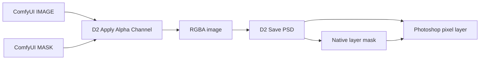
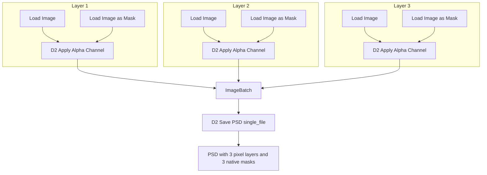

# D2 Save PSD Native Masks for ComfyUI


Save ComfyUI image batches as real layered PSD files. This fork keeps the lean D2 Save PSD node set and upgrades the Photoshop handoff: alpha channels are written as native layer masks on their matching pixel layers.

Open the exported PSD in Photoshop and you get a clean stack of visible layers, each with its mask already attached. No hidden mask layers, no post-export script, no manual channel paste ritual.

## What This Fork Adds

The original `D2 Save PSD` node exported alpha channels as separate hidden pixel layers. This fork uses `psd-tools` layer mask support so each RGBA image becomes one Photoshop layer with one attached pixel mask.



For multi-layer PSDs, batch the RGBA images before `D2 Save PSD` and set `file_mode` to `single_file`.

## Attribution

This project is derived from [da2el-ai/D2-SavePSD-ComfyUI](https://github.com/da2el-ai/D2-SavePSD-ComfyUI), originally created by Shingo.T / da2el-ai and released under the MIT License.

This repository is independently maintained by glaseagle. It is not affiliated with, endorsed by, or maintained by the original author.

The original project provided the ComfyUI nodes for PSD output, alpha application, and alpha extraction. This derivative preserves that node surface and changes PSD export so Photoshop layer masks are already applied when the file opens.

Original repository:

```text
https://github.com/da2el-ai/D2-SavePSD-ComfyUI
```

Fork repository:

```text
https://github.com/glaseagle/D2-SavePSD-ComfyUI-NativeMasks
```

## Install

From your ComfyUI folder:

```powershell
cd custom_nodes
git clone https://github.com/glaseagle/D2-SavePSD-ComfyUI-NativeMasks.git D2-SavePSD-ComfyUI-NativeMasks
cd D2-SavePSD-ComfyUI-NativeMasks
..\..\.venv\Scripts\python.exe install.py
```

If your ComfyUI Python environment lives somewhere else, run `install.py` with that environment's Python. Then restart ComfyUI.

The installer adds:

- `psd-tools`
- `scikit-image`

## Nodes

### D2 Save PSD

Writes incoming images to PSD.

Inputs:

- `images`: An `IMAGE` or batched `IMAGE` input.
- `filename_prefix`: Same style as ComfyUI's built-in `Save Image` node.
- `file_mode`: `single_file` writes a batch as layers in one PSD; `multi_file` writes one PSD per image.
- `alpha_name`: Kept for workflow compatibility. This fork writes native masks, so it does not create separate alpha layers.
- `alpha_name_mode`: Kept for workflow compatibility.

Native masks are created when the incoming image has an alpha channel. The easiest way to produce that is with `D2 Apply Alpha Channel`.

### D2 Apply Alpha Channel

Combines an `IMAGE` and a `MASK` into one RGBA image. Feed these RGBA outputs into `D2 Save PSD` to get Photoshop layers with masks already attached.

Inputs:

- `image`: The visible RGB layer content.
- `mask`: The grayscale mask to attach.
- `invert_mask`: Flips the mask before writing it into alpha.

### D2 Extract Alpha

Splits a D2-applied alpha channel back into:

- `MASK`
- RGBA `IMAGE`

## Multi-Layer Masked PSD Workflow



For a three-layer PSD:

1. Add three image inputs.
2. Add three mask inputs.
3. Pair each image and mask with `D2 Apply Alpha Channel`.
4. Batch the three RGBA outputs with `ImageBatch`.
5. Send the final batch into `D2 Save PSD`.
6. Set `file_mode` to `single_file`.

Photoshop should open the result as three pixel layers, each with its own layer mask.

## Output Location

PSD files are saved under your ComfyUI output directory. For example:

```text
ComfyUI/output/D2_SavePSD/layers_masks_00001_.psd
```

The subfolder comes from your `filename_prefix`. A prefix like:

```text
D2_SavePSD/layers_masks
```

will save into:

```text
ComfyUI/output/D2_SavePSD/
```

## Verified Behavior

The native-mask smoke test uses a three-layer workflow and confirms the generated PSD with `psd-tools`:

```text
layer_count 3
Layer 1 visible=True has_mask=True
Layer 2 visible=True has_mask=True
Layer 3 visible=True has_mask=True
```

An importable smoke workflow is included at:

```text
workflows/d2_native_masks_3_layer_smoke.json
```

The command-line smoke workflow is documented in [AGENTS.md](AGENTS.md).

## Notes and Limits

- Layer masks are pixel masks, not vector masks.
- Layer names are generated as `Layer 1`, `Layer 2`, and so on by the saver.
- `alpha_name` and `alpha_name_mode` remain in the node so older workflows still load, but this fork no longer emits standalone mask layers.
- If an input image has no alpha channel, the PSD layer is written without a mask.
- This is an independent fork, not an official upstream release.

## License

MIT, preserving the original license and copyright notice from the upstream project.
