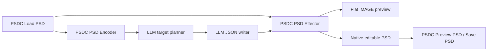
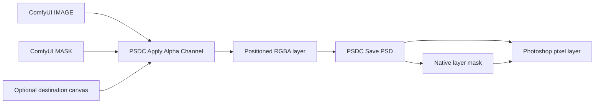
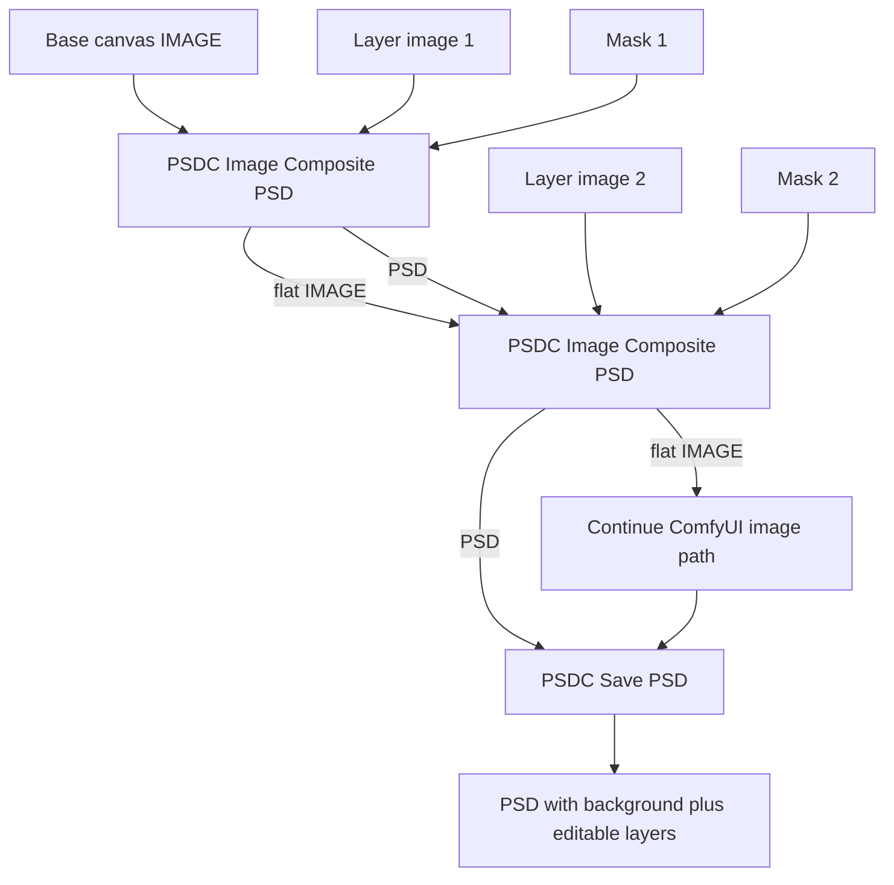
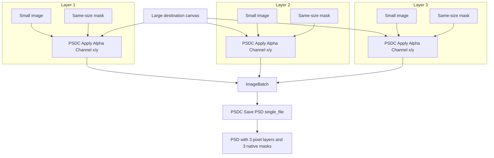

# PSDC


PSDC is a native Photoshop PSD editor for ComfyUI. It loads real `.psd` files, exposes their layer structure as LLM-readable JSON, applies JSON edit scripts back onto native Photoshop documents, and keeps the normal ComfyUI flat `IMAGE` path in parity with a parallel editable `PSD` path.

Layer-mask export was the starting point. The current focus is broader: AI-generated PSDs with native layer masks, editable text, editable adjustment/fill layers, blend modes, layer effects, groups, and preservation of uploaded Photoshop documents while ComfyUI adds or composites new layers.

The goal is to make ComfyUI a production PSD pipeline: generate a flat preview image for the rest of the graph, while also producing a non-destructive PSD that can be opened and continued in Photoshop.

## Main PSD Editing Workflow

The main native editing path is:



The direct create-from-text path is also supported:

```text
prompt -> LLM JSON writer -> PSDC PSD Effector -> IMAGE + editable PSD
```

For image generation and compositing, `PSDC Image Composite PSD`, `PSDC Image To PSD`, and `PSDC PSD Layer Combine` keep adding raster image/mask layers to the same carried `PSD` track while the graph continues to use the normal flattened `IMAGE` output.

## Native PSD Editing Contract

PSDC is now centered on native PSD editing, not only PSD export. The current supported contract is:

| Area | Supported now | Notes |
| --- | --- | --- |
| Layer targeting | Existing layers can be targeted by Photoshop layer ID, index path, full layer path, or unique name. Layers can be duplicated, moved into groups, reordered, and translated. | The encoder emits these fields so LLM patches can point at the right layer. ID is preferred. Duplicate names/paths now produce ambiguity diagnostics instead of silently picking the wrong layer. |
| Text | Create editable text layers with optional style controls. Replace text in direct Photoshop type layers and in embedded PSD/PSB smart-object text layers. | Single-style and multi-style/multi-paragraph run lengths are updated safely. Existing style runs are preserved by default; optional style fields can set size, color, alignment, tracking, leading, faux bold, and faux italic. |
| Adjustment/fill layers | Create native editable adjustment/fill layers from PSDC's prototype library. Edit existing adjustment layers when their native descriptor/tag is exposed. | Curves and common raw adjustment descriptors are the strongest path. For exact Photoshop controls, use `raw` data copied from the encoder JSON. |
| Blend/compositing metadata | Set layer name, visibility, opacity, fill opacity, blend mode, and clipping. | Blend modes are written back as native Photoshop blend modes. |
| Effects | Create native editable effect-bearing pixel layers for Drop Shadow, Inner Shadow, Outer Glow, Inner Glow, Stroke, and Bevel/Emboss. Edit existing effects when editable descriptors are exposed. | New and existing descriptor-backed effects support common semantic fields such as opacity, distance, size, color, angle, spread, choke, noise, and depth. `raw_descriptors` remains the exact-control escape hatch. |
| Groups | Create groups and insert created native layers into the document root or a targeted group. | Existing group structure is preserved when editing uploaded PSDs. |
| Masks and raster layers | Convert ComfyUI images and masks into PSD pixel layers with native pixel masks. Batch images/masks become multiple layers. | Mask export remains fully supported, but it is now one capability inside the broader PSD editor. |
| Uploaded PSD preservation | Loaded PSDs keep native Photoshop context while PSDC adds new raster, mask, composite, effect, adjustment, text, or group layers. | Save paths preserve original groups, adjustment layers, effects, fill layers, masks, smart objects, and editable text wherever PSDC does not explicitly patch them. |
| JSON-only generation | The Effector can generate a native PSD from JSON without a source PSD. | With no PSD connected, set-style edits such as `set_adjustment`, `set_effect`, and `replace_text` are interpreted as create-style operations on blank/native prototype layers. |

This is not intended to be a blind rasterizer. The useful behavior is native editability: Photoshop should still see real type layers, real adjustment/fill layers, native layer effects, native masks, and preserved source PSD structure where those features are supported by the current operation set.

## Mask Export Foundation

The original `D2 Save PSD` node exported alpha channels as separate hidden pixel layers. PSDC uses `psd-tools` layer mask support so each RGBA image becomes one Photoshop layer with one attached pixel mask.



For multi-layer PSDs, either batch RGBA images before `PSDC Save PSD`, or use `PSDC Image Composite PSD` as a composite node that carries a parallel `PSD` stack beside the normal flat `IMAGE`.

## Attribution

This project is derived from [da2el-ai/D2-SavePSD-ComfyUI](https://github.com/da2el-ai/D2-SavePSD-ComfyUI), originally created by Shingo.T / da2el-ai and released under the MIT License.

This repository is independently maintained by glaseagle. It is not affiliated with, endorsed by, or maintained by the original author.

The original project provided the ComfyUI nodes for PSD output, alpha application, and alpha extraction. This derivative preserves that node surface and changes PSD export so Photoshop layer masks are already applied when the file opens.

Original repository:

```text
https://github.com/da2el-ai/D2-SavePSD-ComfyUI
```

Fork repository:

```text
https://github.com/glaseagle/PSDC
```

## Install

From your ComfyUI folder:

```powershell
cd custom_nodes
git clone https://github.com/glaseagle/PSDC.git PSDC
cd PSDC
..\..\.venv\Scripts\python.exe install.py
```

If your ComfyUI Python environment lives somewhere else, run `install.py` with that environment's Python. Then restart ComfyUI.

The installer adds:

- `psd-tools`
- `scikit-image`

## Nodes

### PSDC Save PSD

Writes incoming images or a connected `PSD` stack to a Photoshop PSD.

Inputs:

- `images`: Optional `IMAGE` or batched `IMAGE` input. With no `PSD`, this writes one layer for a single image or one layer per batch item.
- `filename_prefix`: Same style as ComfyUI's built-in `Save Image` node.
- `file_mode`: `single_file` writes a batch as layers in one PSD; `multi_file` writes one PSD per image.
- `alpha_name`: Kept for workflow compatibility. This fork writes native masks, so it does not create separate alpha layers.
- `alpha_name_mode`: Kept for workflow compatibility.
- `psd`: Optional `PSD` stack from `PSDC Image Composite PSD`. When connected, this takes priority over the direct RGBA-image save path.

Native masks are created when the incoming image has an alpha channel. The easiest way to produce that is with `PSDC Apply Alpha Channel`.

When the `psd` input comes from `PSDC Load PSD`, `PSDC Save PSD` preserves that original PSD as the native base document. If no PSDC layers have been added, the source PSD is copied byte-for-byte. If PSDC image/mask/composite layers have been added above it, the save node reopens the source PSD and appends only those new PSDC layers, keeping the original Photoshop groups, effects, masks, smart objects, fill layers, and adjustment layers intact.

Operations that add image, mask, composite, or combined PSDC layers above a loaded native PSD preserve the native source context. If the canvas must grow, PSDC expands the native document canvas and keeps the original Photoshop layers unscaled so adjustment layers, effects, fill layers, text, masks, groups, and smart objects remain editable.

Native PSD saves normalize global `lnk2` embedded smart-object records for Photoshop compatibility. Some `psd-tools` saves preserve `liFD` records as version 8 while writing a version-7-shaped record body; PSDC downgrades only those global `lnk2/liFD` version fields to 7 so Photoshop can open the exported file without changing embedded PSB payload bytes.

### PSDC Image Composite PSD

Composites like the Essentials `ImageComposite+` node while also building a parallel non-destructive `PSD` stack. The image inputs are intentionally optional so the node can also convert loose images and masks into the PSD track.

Use the `IMAGE` output exactly like a normal flat composite. Daisy-chain the `PSD` output into the next `PSDC Image Composite PSD` node's optional `psd` input, then connect the final `PSD` output to `PSDC Save PSD`.

When a connected source, destination, mask, or PSD would exceed the current canvas, PSDC expands to the largest needed canvas before compositing. Pure raster PSDC stacks are scaled proportionally into the larger canvas. Native-backed PSD stacks preserve the original Photoshop source context and expand the canvas without scaling the native layers.

Inputs:

- `destination`: Optional flat image canvas to composite onto. By itself it becomes a background PSD layer. With a connected `PSD`, it is added as a new higher image layer instead of replacing the PSD base.
- `source`: Optional image layer to place. By itself it becomes a PSD image layer. Batched sources are expanded into separate PSD layers.
- `x`, `y`: Position of the source on the destination canvas.
- `offset_x`, `offset_y`: Extra offsets, matching the Essentials `ImageComposite+` style.
- `mask`: Optional mask. With `source`, it masks the source layer. By itself it creates a transparent 0-opacity PSD layer carrying the mask. With `destination`, it does not mask the destination; it adds that transparent mask layer above the destination. Batched masks are expanded into separate PSD layers, repeating a single source image when needed.
- `psd`: Optional carried PSD stack from a previous PSDC node. When connected, any incoming `destination`, `source`, or mask-only input is added above the existing PSD stack.

Outputs:

- `image`: The flat composited image, for continuing the normal ComfyUI image path.
- `psd`: The Photoshop layer stack with the same placement and mask behavior.

### PSDC Load PSD

Loads a Photoshop `.psd` file from the ComfyUI `input` directory and converts it into a `PSD` stack for the rest of the pipeline.

Inputs:

- `psd_file`: Dropdown of `.psd` files in your ComfyUI `input` folder. Each top-level Photoshop layer becomes a layer in the `PSD` stack, with its mask and position preserved.

Upload behavior:

- The dropdown lists files that already exist in `ComfyUI/input`.
- The node includes a `Choose PSD` button that uploads a local `.psd` into `ComfyUI/input` and selects it.
- Dragging a `.psd` file onto a `PSDC Load PSD` node uploads it and selects it.
- Dragging a `.psd` file onto the Comfy canvas uploads it and creates a populated `PSDC Load PSD` node.
- PSDC uses its own PSD upload endpoint so large layered PSD files do not hit ComfyUI's regular image upload size path.

Outputs:

- `psd`: The loaded Photoshop layer stack. The stack also keeps the original file path so `PSDC Save PSD` can preserve the native source while adding new PSDC layers above it, and so `PSDC PSD Effector` can reopen the source PSD.

### PSDC PSD Encoder

Turns a connected `PSD` into JSON for an LLM to understand. Use it directly after `PSDC Load PSD`.

Inputs:

- `psd`: A PSDC `PSD` stack, usually from `PSDC Load PSD`.
- `pretty`: Pretty-print the JSON with indentation.

Outputs:

- `json`: A `STRING` containing the PSD snapshot.

Loaded native PSDs emit `psdc.native_snapshot.v1` JSON. The snapshot includes the Photoshop layer tree, layer paths, IDs, groups, visibility, opacity, blend modes, masks/effects/adjustment descriptors where readable, smart object metadata, embedded PSD/PSB text layers, and per-layer `supported_operations` for LLM-safe editing.

### PSDC PSD Effector

Takes LLM edit JSON plus an optional original `PSD`, writes a new native PSD, and returns it back into the Comfy graph.

Inputs:

- `edit_json`: LLM output describing the edits.
- `filename_prefix`: Output filename prefix.
- `psd`: Optional original PSDC `PSD` stack from `PSDC Load PSD`.

Outputs:

- `image`: Flattened preview image from the effected PSD.
- `psd`: PSDC `PSD` stack with a native passthrough source pointing at the effected PSD.

The node UI also shows the saved PSD path and a JSON report of applied and failed edits.

Preferred LLM output is a small `psdc.native_patch.v1` operation list. The effector also accepts a full edited snapshot JSON for compatibility with earlier prompts, but the patch form is safer.

With `psd` connected, operations are paired back to the original Photoshop layer structure by ID, index path, full layer path, then name. If the connected PSD is a synthetic PSDC raster stack, the Effector first materializes every incoming raster/mask layer into the native document, then applies native patch operations above that preserved base. If the connected PSD came from `PSDC Load PSD` and has PSDC raster overlays added by composite/combine/image-to-PSD nodes, the Effector reopens the original native PSD, appends those overlays, then applies the native patch. Without `psd`, PSDC starts from a blank native document and instantiates editable layers from create operations. In JSON-only mode, `set_adjustment`, `set_effect`, and `replace_text` are treated as create-style operations so LLM edits can still produce editable adjustment layers, effect layers, and type layers.

The Effector report includes `base_mode` so workflow validation can confirm which path was used:

- `native_source`: original Photoshop PSD was preserved as the base.
- `synthetic_stack`: incoming PSDC raster stack was materialized and preserved before native edits.
- `blank`: no PSD was connected, so the file was created from JSON only.

Reports also include `base_stack_layers` and `base_overlay_layers` when a connected PSD stack contributes raster content.

Recommended Gemini prompt wiring:

- New PSD from text only: use `prompts/psdc-native-json-authoring-prompt.md` as the Gemini system prompt, put your creative request in the regular prompt, then send the JSON output to `PSDC PSD Effector` without a `PSD` input.
- Edit an existing PSD: connect `PSDC Load PSD` to `PSDC PSD Encoder`, send the encoder JSON to Gemini node 1 using `prompts/psdc-native-target-planner-prompt.md` plus your requested change in the system prompt, send that target brief to Gemini node 2 using `prompts/psdc-native-json-authoring-prompt.md`, then send node 2's JSON output and the original `PSD` into `PSDC PSD Effector`.

Supported patch operations:

- `rename_layer`
- `set_visibility`
- `set_opacity`
- `set_fill_opacity`
- `set_blend_mode`
- `set_clipping`
- `duplicate_layer`
- `move_layer`
- `reorder_layer`
- `translate_layer`
- `transform_layer`
- `crop_layer`
- `warp_layer`
- `replace_text`
- `set_adjustment`
- `set_effect`
- `create_group`
- `create_adjustment`
- `create_effect_layer`
- `create_text`

Native duplicate/move/reorder/translate operations preserve the native Photoshop layer object and its masks, effects, smart object metadata, and descriptors where `psd-tools` can safely move the layer record. `transform_layer` currently supports translate-style fields only. Scale, rotate, crop, and warp are recognized but rejected with structured report failures instead of rasterizing or corrupting Photoshop-only transform data.

Native text replacement supports single-style and multi-style Photoshop type layers, plus text inside embedded PSD/PSB smart objects. It updates the text descriptor, EngineData text, and EngineData style/paragraph run lengths. Optional style fields on `replace_text` and `create_text` include `font_size`, `color`, `alignment`, `tracking`, `leading`, `faux_bold`, and `faux_italic`. Font family changes are applied only when the requested font already exists in that layer's Photoshop FontSet.

Native layer creation uses PSDC's bundled Photoshop prototype library. `create_adjustment` can instantiate editable adjustment/fill layers such as Curves, Levels, Hue/Saturation, Solid Color Fill, Gradient Fill, Pattern Fill, Gradient Map, Vibrance, Exposure, and the other bundled prototypes. `create_effect_layer` can instantiate editable effect-bearing pixel layers for Drop Shadow, Inner Shadow, Outer Glow, Inner Glow, Stroke, and Bevel/Emboss. `create_text` can instantiate an editable single-style-run type layer. Common semantic fields are supported, and `raw` / `raw_descriptors` can be used for descriptor-level control.

Example Effector patch:

```json
{
  "schema": "psdc.native_patch.v1",
  "operations": [
    {
      "op": "create_adjustment",
      "type": "curves",
      "name": "AI Contrast Curve",
      "value": {
        "channels": [
          {
            "channel": "composite",
            "points": [
              { "input": 0, "output": 0 },
              { "input": 128, "output": 150 },
              { "input": 255, "output": 255 }
            ]
          }
        ]
      }
    },
    {
      "op": "create_effect_layer",
      "effect": "drop_shadow",
      "name": "AI Drop Shadow Layer",
      "value": {
        "opacity": 55,
        "distance": 18,
        "size": 24,
        "color": "#112233"
      }
    }
  ]
}
```

### PSDC PSD Decoder

Turns raw encoder JSON back into a PSDC stack backed by a native PSD file.

Inputs:

- `json_text`: Raw JSON from `PSDC PSD Encoder`.
- `batch_size`: Batch size used when decoding JSON without a connected PSD.
- `psd`: Optional original PSDC `PSD` stack.

Outputs:

- `image`: Flattened preview image.
- `psd`: PSDC `PSD` stack with a native passthrough source.

With `psd` connected, the decoder applies the JSON to the original native Photoshop structure and pairs layers by ID, index path, full layer path, then name. Without `psd`, JSON has no pixel data, so the decoder creates a blank native document and instantiates editable type layers, adjustment/fill layers, and effect layers from PSDC's prototypes. Pixel-only or smart-object layers without native descriptor data become transparent blank raster placeholders because the JSON does not contain pixels or embedded smart-object binaries.

### PSDC Preview PSD

Flattens a `PSD` stack and displays it in ComfyUI like the built-in `Preview Image` node. It writes temporary PNG previews only; it does not save a PSD file and it has no output sockets.

Inputs:

- `psd`: A PSDC `PSD` stack to flatten for preview.

Outputs:

- None. The preview appears in the node UI/history as temporary images.

### PSDC Image To PSD

Converts a loose `IMAGE` or `IMAGE` plus `MASK` into the PSD track without setting up a full composite node.

Inputs:

- `image`: Image layer content. A batched image becomes one PSD layer per batch item.
- `mask`: Optional layer mask. Batched masks become one PSD layer per mask, repeating a single image when needed.
- `psd`: Optional existing PSD track. When connected, the image/mask layers are added above it.

Outputs:

- `image`: The flat result after adding the new layer or layers.
- `psd`: The updated PSD stack.

### PSDC PSD Layer Combine

Combines layers from two or more `PSD` inputs into one stack.

Inputs:

- `psds`: Dynamic PSD inputs. The node starts with two PSD sockets, then reveals the next socket as the last visible one is connected.

Outputs:

- `image`: The flattened combined PSD.
- `psd`: A combined non-destructive PSD stack.

Layers are added in socket order from bottom to top. If the input PSDs have different canvas sizes, the output uses the largest needed canvas. Pure raster PSDC stacks are scaled proportionally into that canvas before their layers are added. If any input carries native Photoshop context from `PSDC Load PSD`, Layer Combine preserves the first native source as the base PSD and adds the other inputs as raster overlay layers above it, so the original non-destructive Photoshop layers survive the later `PSDC Save PSD` step.

On older ComfyUI versions without dynamic socket support, the node falls back to fixed `psd_1` through `psd_8` inputs.

### PSDC Apply Alpha Channel

Combines an `IMAGE` and a `MASK` into one RGBA image. With an optional `destination` connected, it places the image and mask onto that larger canvas using `x`, `y`, `offset_x`, and `offset_y`, filling the rest of the alpha/mask channel with black.

Feed these RGBA outputs into `PSDC Save PSD` to get Photoshop layers with masks already attached and positioned.

Inputs:

- `image`: The visible RGB layer content.
- `mask`: The grayscale mask to attach.
- `invert_mask`: Flips the mask before writing it into alpha.
- `x`, `y`: Position of the smaller image and mask on the destination canvas.
- `offset_x`, `offset_y`: Extra offsets, matching the Essentials `ImageComposite+` style.
- `destination`: Optional larger canvas. When omitted, the output keeps the input image size.

### PSDC Extract Alpha

Splits a PSDC-applied alpha channel back into:

- `MASK`
- RGBA `IMAGE`

## Multi-Layer Masked PSD Workflow

Recommended composite workflow:



RGBA-batch workflow:



For a three-layer PSD:

1. Add one larger destination canvas.
2. Add each smaller image and its same-size mask.
3. Pair each image and mask with `PSDC Apply Alpha Channel`.
4. Set `x` and `y` on each PSDC alpha node.
5. Batch the positioned RGBA outputs with `ImageBatch`.
6. Send the final batch into `PSDC Save PSD`.
7. Set `file_mode` to `single_file`.

Photoshop should open the result as three pixel layers, each with its own layer mask.

## Output Location

PSD files are saved under your ComfyUI output directory. For example:

```text
ComfyUI/output/PSDC_SavePSD/layers_masks_00001_.psd
```

The subfolder comes from your `filename_prefix`. A prefix like:

```text
PSDC_SavePSD/layers_masks
```

will save into:

```text
ComfyUI/output/PSDC_SavePSD/
```

## Verified Behavior

The native-mask smoke test uses a three-layer workflow and confirms the generated PSD with `psd-tools`:

```text
layer_count 3
Layer 1 visible=True has_mask=True mask_bbox=(520, 430, 700, 690)
Layer 2 visible=True has_mask=True mask_bbox=(330, 240, 610, 420)
Layer 3 visible=True has_mask=True mask_bbox=(64, 96, 284, 256)
```

An importable smoke workflow is included at:

```text
workflows/psdc_native_masks_3_layer_smoke.json
```

The command-line smoke workflow is documented in [AGENTS.md](AGENTS.md).

Example native PSD generated through `PSDC PSD Effector`:

```text
examples/psdc_curves_fill_comfy_generated.psd
examples/psdc_text_layer_comfy_generated.psd
examples/psdc_templatetest_add_text_comfy_generated.psd
examples/psdc_templatetest_modify_existing_text_comfy_generated.psd
```

The first contains an editable Solid Color Fill layer and an editable Curves adjustment layer. The second contains an editable type layer over a Solid Color Fill background. The TemplateTest examples show adding a new editable text layer to an existing PSD and replacing the embedded title text inside `Title Treatment 100.psb`. The patch/workflow JSON used to generate each PSD is included next to the PSD.

Per-feature validation workflows are included under `workflows/`. Each validation folder contains a Comfy API workflow JSON plus an `output/` folder with the produced PSD/PNG and `validation_report.json`. `workflows/psdc_validation_summary.json` records the latest run across:

- requested native layer operations
- requested semantic effect edits
- requested effect descriptor warning behavior
- requested multi-style text replacement
- requested text style controls
- requested preview refresh metadata
- requested duplicate-name targeting
- requested effector raster stack preservation
- requested full-feature JSON recreation
- requested randomize all adjustable parameters
- existing native mask export
- existing image composite PSD
- existing image-to-PSD
- existing PSD layer combine
- existing PSD encoder/decoder
- existing load/save preservation
- existing PSD preview
- existing alpha extraction

## Notes and Limits

- Layer masks are pixel masks, not vector masks.
- `PSDC Image Composite PSD` creates a `Background` layer from the first destination image when no `PSD` input is connected, then adds `Layer 1`, `Layer 2`, and so on for each composite.
- `transform_layer`, `crop_layer`, and `warp_layer` are recognized by the Effector schema, but native scale/rotate/crop/warp editing is not implemented unless it can be represented as a safe translate-style record update. Unsupported transform fields fail explicitly in the Effector report.
- `alpha_name` and `alpha_name_mode` remain in the node so older workflows still load, but this fork no longer emits standalone mask layers.
- If an input image has no alpha channel, the PSD layer is written without a mask.
- When a `PSD` stack has multiple batch entries, `single_file` saves batch 0. Use `multi_file` to save one PSD per batch entry.
- This is an independent fork, not an official upstream release.

## License

MIT, preserving the original license and copyright notice from the upstream project.
