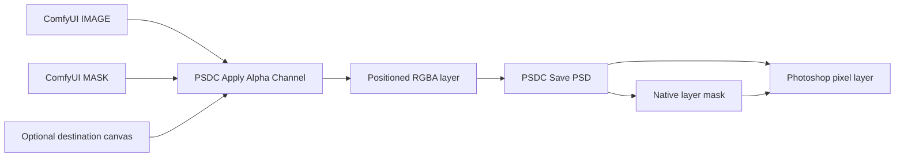
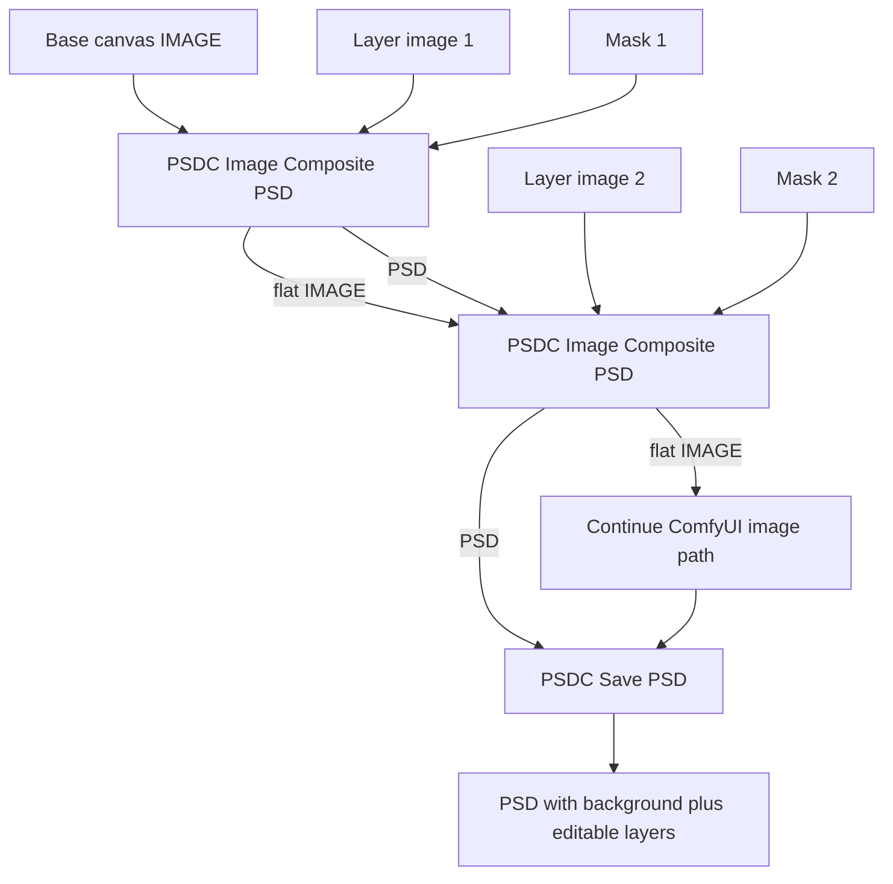
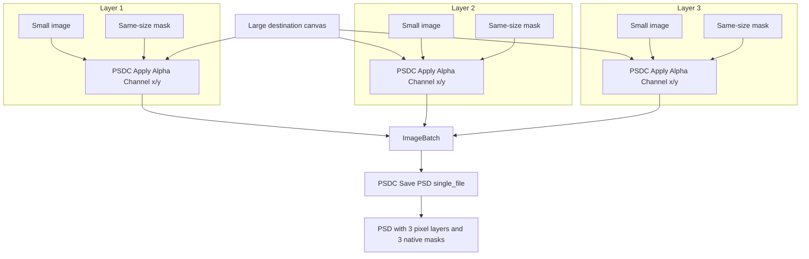

# PSDC


PSDC is a ComfyUI custom node pack for saving image batches and non-destructive composite stacks as layered Photoshop PSD files with native layer masks.

Save ComfyUI image batches as real layered PSD files. This fork keeps the lean Save PSD node set and upgrades the Photoshop handoff: alpha channels are written as native layer masks on their matching pixel layers.

Open the exported PSD in Photoshop and you get a clean stack of visible layers, each with its mask already attached. No hidden mask layers, no post-export script, no manual channel paste ritual.

## What This Fork Adds

The original `D2 Save PSD` node exported alpha channels as separate hidden pixel layers. This fork uses `psd-tools` layer mask support so each RGBA image becomes one Photoshop layer with one attached pixel mask.



For multi-layer PSDs, either batch RGBA images before `PSDC Save PSD`, or use `PSDC Image Composite PSD` as a drop-in-style composite node that carries a parallel `PSD` stack beside the normal flat `IMAGE`.

## Attribution

This project is derived from [da2el-ai/D2-SavePSD-ComfyUI](https://github.com/da2el-ai/D2-SavePSD-ComfyUI), originally created by Shingo.T / da2el-ai and released under the MIT License.

This repository is independently maintained by glaseagle. It is not affiliated with, endorsed by, or maintained by the original author.

The original project provided the ComfyUI nodes for PSD output, alpha application, and alpha extraction. This derivative preserves that node surface and changes PSD export so Photoshop layer masks are already applied when the file opens.

Original repository:

```text
https://github.com/da2el-ai/D2-SavePSD-ComfyUI
```

Fork repository:

```text
https://github.com/glaseagle/PSDC
```

## Install

From your ComfyUI folder:

```powershell
cd custom_nodes
git clone https://github.com/glaseagle/PSDC.git PSDC
cd PSDC
..\..\.venv\Scripts\python.exe install.py
```

If your ComfyUI Python environment lives somewhere else, run `install.py` with that environment's Python. Then restart ComfyUI.

The installer adds:

- `psd-tools`
- `scikit-image`

## Nodes

### PSDC Save PSD

Writes incoming images or a connected `PSD` stack to a Photoshop PSD.

Inputs:

- `images`: Optional `IMAGE` or batched `IMAGE` input. With no `PSD`, this writes one layer for a single image or one layer per batch item.
- `filename_prefix`: Same style as ComfyUI's built-in `Save Image` node.
- `file_mode`: `single_file` writes a batch as layers in one PSD; `multi_file` writes one PSD per image.
- `alpha_name`: Kept for workflow compatibility. This fork writes native masks, so it does not create separate alpha layers.
- `alpha_name_mode`: Kept for workflow compatibility.
- `psd`: Optional `PSD` stack from `PSDC Image Composite PSD`. When connected, this takes priority over the legacy RGBA-image save path.

Native masks are created when the incoming image has an alpha channel. The easiest way to produce that is with `PSDC Apply Alpha Channel`.

### PSDC Image Composite PSD

Composites like the Essentials `ImageComposite+` node while also building a parallel non-destructive `PSD` stack. The image inputs are intentionally optional so the node can also convert loose images and masks into the PSD track.

Use the `IMAGE` output exactly like a normal flat composite. Daisy-chain the `PSD` output into the next `PSDC Image Composite PSD` node's optional `psd` input, then connect the final `PSD` output to `PSDC Save PSD`.

Inputs:

- `destination`: Optional flat image canvas to composite onto. By itself it becomes a background PSD layer. With a connected `PSD`, it is added as a new higher image layer instead of replacing the PSD base.
- `source`: Optional image layer to place. By itself it becomes a PSD image layer. Batched sources are expanded into separate PSD layers.
- `x`, `y`: Position of the source on the destination canvas.
- `offset_x`, `offset_y`: Extra offsets, matching the Essentials `ImageComposite+` style.
- `mask`: Optional mask. With `source`, it masks the source layer. By itself it creates a transparent 0-opacity PSD layer carrying the mask. With `destination`, it does not mask the destination; it adds that transparent mask layer above the destination. Batched masks are expanded into separate PSD layers, repeating a single source image when needed.
- `psd`: Optional carried PSD stack from a previous PSDC node. When connected, any incoming `destination`, `source`, or mask-only input is added above the existing PSD stack.

Outputs:

- `image`: The flat composited image, for continuing the normal ComfyUI image path.
- `psd`: The Photoshop layer stack with the same placement and mask behavior.

### PSD Load

Loads a Photoshop `.psd` file from the ComfyUI `input` directory and converts it into a `PSD` stack for the rest of the pipeline.

Inputs:

- `psd_file`: Dropdown of `.psd` files in your ComfyUI `input` folder. Each top-level Photoshop layer becomes a layer in the `PSD` stack, with its mask and position preserved.

Outputs:

- `psd`: The loaded Photoshop layer stack.

### PSDC Image To PSD

Converts a loose `IMAGE` or `IMAGE` plus `MASK` into the PSD track without setting up a full composite node.

Inputs:

- `image`: Image layer content. A batched image becomes one PSD layer per batch item.
- `mask`: Optional layer mask. Batched masks become one PSD layer per mask, repeating a single image when needed.
- `psd`: Optional existing PSD track. When connected, the image/mask layers are added above it.

Outputs:

- `image`: The flat result after adding the new layer or layers.
- `psd`: The updated PSD stack.

### PSDC Apply Alpha Channel

Combines an `IMAGE` and a `MASK` into one RGBA image. With an optional `destination` connected, it places the image and mask onto that larger canvas using `x`, `y`, `offset_x`, and `offset_y`, filling the rest of the alpha/mask channel with black.

Feed these RGBA outputs into `PSDC Save PSD` to get Photoshop layers with masks already attached and positioned.

Inputs:

- `image`: The visible RGB layer content.
- `mask`: The grayscale mask to attach.
- `invert_mask`: Flips the mask before writing it into alpha.
- `x`, `y`: Position of the smaller image and mask on the destination canvas.
- `offset_x`, `offset_y`: Extra offsets, matching the Essentials `ImageComposite+` style.
- `destination`: Optional larger canvas. When omitted, the output keeps the input image size.

### PSDC Extract Alpha

Splits a PSDC-applied alpha channel back into:

- `MASK`
- RGBA `IMAGE`

## Multi-Layer Masked PSD Workflow

Recommended composite workflow:



Legacy RGBA-batch workflow:



For a three-layer PSD:

1. Add one larger destination canvas.
2. Add each smaller image and its same-size mask.
3. Pair each image and mask with `PSDC Apply Alpha Channel`.
4. Set `x` and `y` on each PSDC alpha node.
5. Batch the positioned RGBA outputs with `ImageBatch`.
6. Send the final batch into `PSDC Save PSD`.
7. Set `file_mode` to `single_file`.

Photoshop should open the result as three pixel layers, each with its own layer mask.

## Output Location

PSD files are saved under your ComfyUI output directory. For example:

```text
ComfyUI/output/PSDC_SavePSD/layers_masks_00001_.psd
```

The subfolder comes from your `filename_prefix`. A prefix like:

```text
PSDC_SavePSD/layers_masks
```

will save into:

```text
ComfyUI/output/PSDC_SavePSD/
```

## Verified Behavior

The native-mask smoke test uses a three-layer workflow and confirms the generated PSD with `psd-tools`:

```text
layer_count 3
Layer 1 visible=True has_mask=True mask_bbox=(520, 430, 700, 690)
Layer 2 visible=True has_mask=True mask_bbox=(330, 240, 610, 420)
Layer 3 visible=True has_mask=True mask_bbox=(64, 96, 284, 256)
```

An importable smoke workflow is included at:

```text
workflows/psdc_native_masks_3_layer_smoke.json
```

The command-line smoke workflow is documented in [AGENTS.md](AGENTS.md).

## Notes and Limits

- Layer masks are pixel masks, not vector masks.
- `PSDC Image Composite PSD` creates a `Background` layer from the first destination image when no `PSD` input is connected, then adds `Layer 1`, `Layer 2`, and so on for each composite.
- `alpha_name` and `alpha_name_mode` remain in the node so older workflows still load, but this fork no longer emits standalone mask layers.
- If an input image has no alpha channel, the PSD layer is written without a mask.
- When a `PSD` stack has multiple batch entries, `single_file` saves batch 0. Use `multi_file` to save one PSD per batch entry.
- This is an independent fork, not an official upstream release.

## License

MIT, preserving the original license and copyright notice from the upstream project.
